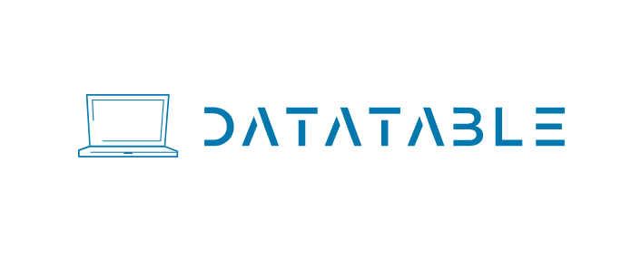
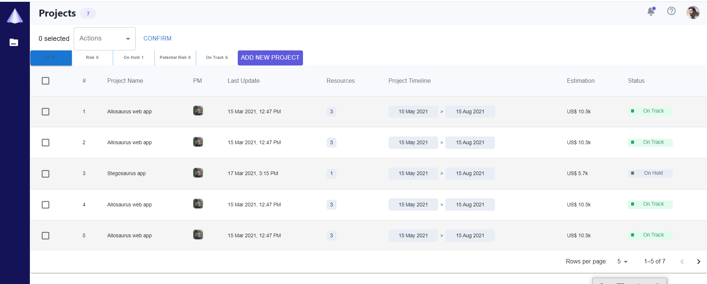
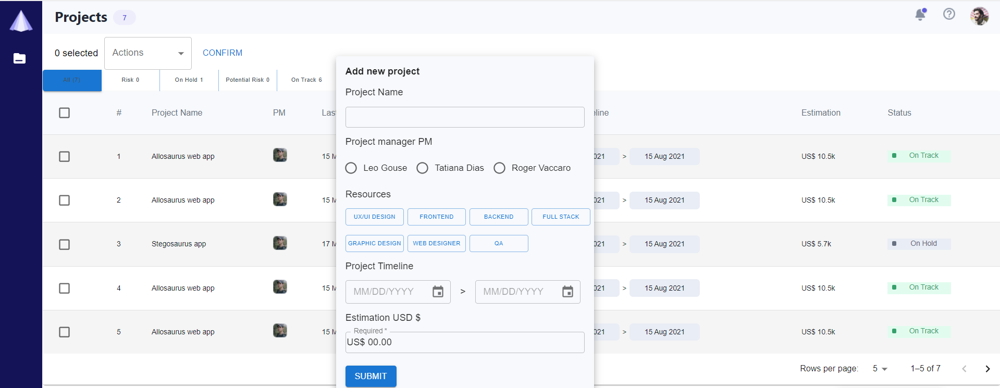
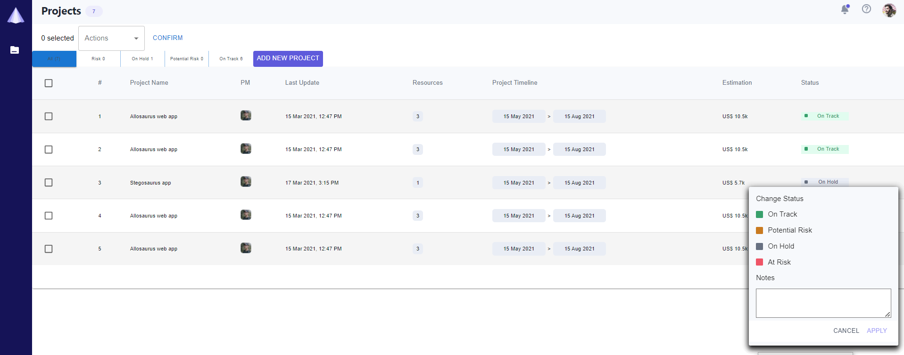
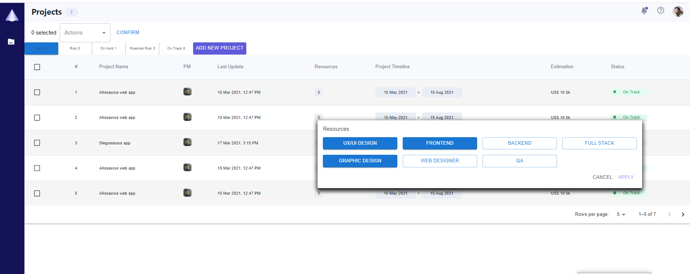

<h1 align="center">
    </a>
    
    </a>
</h1>

  <i align="center">Simple Data Table created with React/Mui  🚀</i>

## Introduction

`DataTable` Project Task Tracker is an application designed for managing project information and related tasks. It provides a convenient way to track project progress and efficiently manage tasks associated with each project.

 Features

  

Displaying a table with information about projects, including project name, project manager, last update date, resources, project timeline, estimation, and current status.
Setting statuses for projects such as "On Track," "Potential Risk," "On Hold," "At Risk," and more.
Providing detailed information about each project's tasks and their timeline.
Filtering projects based on status and other parameters.

    
&nbsp;
    

    
&nbsp;
    

## Technologies Used
* React.js for building the user interface
* Material-UI for styling components and tables
* JavaScript for handling application logic

## Installation and Setup

* Clone the repository to your local machine.
* Make sure you have Node.js and npm installed.
* Navigate to the project directory in your terminal and run npm install to install dependencies.
* Start the application using the command npm start.
* Open your web browser and go to http://localhost:3000 to begin using the Project Task Tracker app.

